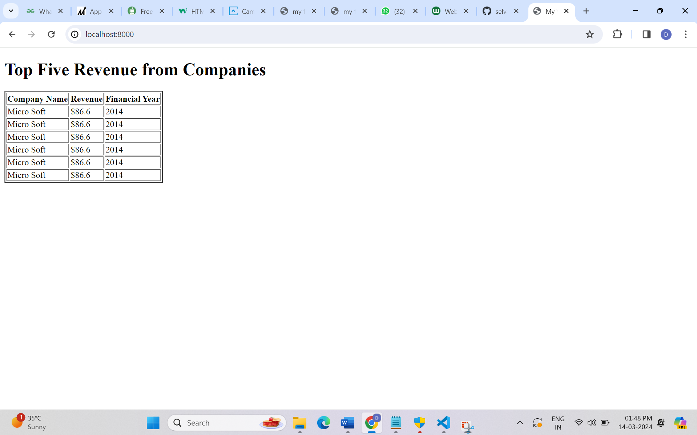

# EX01 Developing a Simple Webserver
## Date:

## AIM:
To develop a simple webserver to serve html pages.

## DESIGN STEPS:
### Step 1: 
HTML content creation.

### Step 2:
Design of webserver workflow.

### Step 3:
Implementation using Python code.

### Step 4:
Serving the HTML pages.

### Step 5:
Testing the webserver.

## PROGRAM:
```
from http.server import HTTPServer,BaseHTTPRequestHandler

content="""
<!doctype html>
<html>
    <head>
    <title> My Web Server</title>
    </head>
    <body>
    <center>
    <h1>Top Five Revenue from Companies</h1>
    <table bgcolor="yellow" border=10 cellspacing=2 cellpadding=2 width=750 height=500>
        <tr bgcolor="green" align="center">
            <th> Company Name</th>
            <th> Revenue</th>
            <th> Financial Year</th>
        </tr>

        <tr align="center">
            <td bgcolor="green"> Micro Soft</td>
            <td> $203.08 billion</td>
            <td> 2014</td>
        </tr>
        <tr align="center">
            <td bgcolor="green"> Google</td>
            <td> $305.6 billion</td>
            <td> 2012</td>
        </tr>
        <tr align="center">
            <td bgcolor="green"> Firefox</td>
            <td> $450 million</td>
            <td> 2009</td>
        </tr>
        <tr align="center">
            <td bgcolor="green">SAP SE </td>
            <td> $32.97 billion</td>
            <td> 2014</td>
        </tr>
        <tr align="center">
            <td bgcolor="green"> Oracle corp</td>
            <td> $46.07 billion</td>
            <td> 2009</td>
        </tr>
        <tr align="center">
            <td bgcolor="green"> VMware.Inc</td>
            <td> $13.17</td>
            <td> 2011</td>
        </tr>
    </table>
    </center>
    </body>
</html>
"""

class MyServer(BaseHTTPRequestHandler):
    def do_GET(self):
        print("Get request received...")
        self.send_response(200) 
        self.send_header('content-type', 'text/html; charset=utf')       
        self.end_headers()
        self.wfile.write(content.encode())
server_address =('',8000)
httpd = HTTPServer(server_address,MyServer)
print("my webserver is running.....") 
httpd.serve_forever()
```


## OUTPUT:


## RESULT:
The program for implementing simple webserver is executed successfully.
